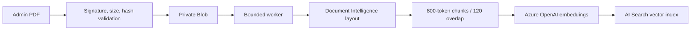
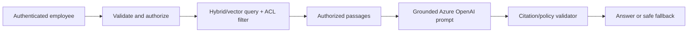

# SmartAssist AI (CGSmartK)

SmartAssist AI is a .NET 8 MVC knowledge assistant. Knowledge Administrators approve PDFs; a bounded worker stores and extracts them, creates token-aware chunks and embeddings, and indexes them in Azure AI Search. Employees receive only grounded answers with verified page citations, deterministic confidence, UTC timestamp, and correlation ID.

## Architecture and flows




Clean Architecture projects are `src/CGSmartK.Domain` (rules), `Application` (use cases/contracts), `Infrastructure` (managed-identity Azure adapters, worker, MCP boundary), and `Web` (MVC/auth/UI). Tests under `tests/` cover core behavior, MVC protection, and dependency direction. See [architecture](docs/architecture.md).

## Run the application locally

The application uses the existing Azure resources listed in [Azure inventory](docs/azure-resources.md). Your account must have access to those resources; the setup scripts only inspect and configure existing resources and do not create or delete anything.

1. Install the required tools:
   - [.NET 8 SDK](https://dotnet.microsoft.com/download/dotnet/8.0)
   - [PowerShell 7](https://learn.microsoft.com/powershell/scripting/install/installing-powershell)
   - [Azure CLI](https://learn.microsoft.com/cli/azure/install-azure-cli)

2. Clone the repository and enter its directory:

   ```bash
   git clone <repository-url>
   cd CGSmartK
   ```

3. Sign in to the required Azure tenant. Run this and the remaining commands from PowerShell 7 (`pwsh` on macOS or Linux):

   ```powershell
   az login --tenant b24388d9-c6ca-4c64-a601-5edb6e666e1e
   ```

4. Select the subscription that contains the existing SmartAssist resources:

   ```powershell
   az account set --subscription bae405f7-48fe-48ae-a393-b10c8205792d
   ```

5. Verify the required tools, Azure login, subscription, and read-only resource access:

   ```powershell
   ./scripts/Test-Prerequisites.ps1
   ```

6. Save the non-secret Azure endpoints and resource names in .NET user secrets:

   ```powershell
   ./scripts/Configure-LocalDevelopment.ps1
   ```

   The application uses `DefaultAzureCredential`, which picks up your Azure CLI login during local development. The script does not store access keys or tokens.

7. Restore the NuGet packages:

   ```powershell
   dotnet restore CGSmartK.sln
   ```

8. Run the MVC web application:

   ```powershell
   dotnet run --project src/CGSmartK.Web/CGSmartK.Web.csproj
   ```

9. Open `https://localhost:51788` in a browser. If your browser does not trust the local HTTPS development certificate, run `dotnet dev-certs https --trust`, restart the application, and open the URL again. Alternatively, use `http://localhost:51789` for local development.

10. Use the application:
    - The default development identity is `dev-employee`.
    - To use the Knowledge Administrator pages, open `https://localhost:51788/?as=admin` (or add `?as=admin` to another application URL).
    - As an administrator, upload a synthetic PDF and wait until its status is **Indexed**. Then return to the assistant and ask a question supported by that PDF. The included demo fixture is test data, not company policy.

11. Stop the application by pressing <kbd>Ctrl</kbd>+<kbd>C</kbd> in the terminal running it.

Development authentication is enabled only when `ASPNETCORE_ENVIRONMENT` is `Development`, as set by the project's launch profile. Production authentication fails closed if App Service Authentication does not provide a principal.

## Configuration contract

Environment variables use `__` in App Service and map to the shown `:` paths.

| Setting | Required | Secret? | Safe default/purpose |
|---|---:|---:|---|
| `APPLICATIONINSIGHTS_CONNECTION_STRING` | Production | Yes | Set only in App Service |
| `SmartAssist:AzureOpenAI:Endpoint` | Yes | No | Queried by setup; intentionally blank in source |
| `SmartAssist:AzureOpenAI:ChatDeployment` | Yes | No | `smartassist-chat` |
| `SmartAssist:AzureOpenAI:EmbeddingDeployment` | Yes | No | `smartassist-embedding` |
| `SmartAssist:Search:Endpoint` | Yes | No | Existing Search endpoint |
| `SmartAssist:Search:IndexName` | Yes | No | `smartassist-knowledge-index` |
| `SmartAssist:Storage:AccountName` / `ContainerName` | Yes | No | Existing account/private container |
| `SmartAssist:DocumentIntelligence:Endpoint` | Yes | No | Queried; intentionally blank in source |
| `SmartAssist:KeyVault:Uri` | Yes | No | Existing vault URI |
| `ASPNETCORE_ENVIRONMENT` | Yes | No | `Development` locally, `Production` in Azure |
| `SmartAssist:Mcp:*` | No | endpoint no; auth yes | Disabled by default |

Non-secret ingestion/retrieval values are in `appsettings.json`. Never populate source files with credentials.

Blob Storage does **not** use a connection string. `Storage:AccountName` is used to build the standard Blob service endpoint, and `DefaultAzureCredential` authenticates the local Azure CLI identity in development or the Web App managed identity in Azure. A Blob `403 AuthorizationPermissionMismatch` during upload means the authenticated identity cannot list/read/write blobs at the configured account/container; it is not repaired by adding an account key. Run `Test-AzureAccess.ps1` to check the configured setting names, the Web App identity, its inherited RBAC assignments, and separately labelled data-plane access for the current Azure CLI identity. The Web App identity requires **Storage Blob Data Contributor** at the storage account (or an inherited) scope, and role changes can require propagation time before retrying.

## Build, test, and deploy

```powershell
dotnet restore CGSmartK.sln
dotnet build CGSmartK.sln --configuration Release --no-restore
dotnet test CGSmartK.sln --configuration Release --no-build
./scripts/Test-AzureAccess.ps1
./scripts/Deploy-WebApp.ps1 -ConfirmDeployment
```

Deployment uses the caller's Azure login and existing Web App only. The script never creates resources. Live smoke operations are opt-in because they can touch data-plane objects.

## Authentication and remaining owner setup

Production fails closed unless App Service Authentication forwards a principal. The owner must create an Entra app registration, configure redirect URI `https://web-smartapp-f59ee617.azurewebsites.net/.auth/login/aad/callback`, expose/consent required scopes, assign Employee/KnowledgeAdministrator app roles or group mappings, configure App Service Authentication with tenant/client ID, require authentication, and preserve the Easy Auth principal headers. No client ID exists in this repository.

MCP is not required. Configure a real allowlisted endpoint and workload-identity/managed-identity authentication as described in [MCP integration](docs/mcp-integration.md). The current adapter is disabled; synthetic output is explicitly labeled and development-only.

## Operations, security, and limits

Health endpoints are `/health/live` and `/health/ready`; anonymous responses contain no resource identifiers. Logs contain IDs, counts, result codes, and durations—not document text, prompts, answers, tokens, or personal details. Search applies classification/group filters before context construction. Blob links are never public.

The bounded in-process queue is appropriate only for one B1 instance: restarts can lose queued work although document metadata survives. At scale, replace it with Azure Storage Queue/Service Bus and an independent worker. See [operations](docs/operations.md), [security](docs/security.md), and [Azure inventory](docs/azure-resources.md).

Troubleshooting: allow RBAC propagation and verify exact roles with `Test-AzureAccess.ps1`; update configured deployment names if a model retires; treat vector dimension/index incompatibility as a controlled migration rather than destructive replacement; malformed/encrypted PDFs fail with a correlation ID; dependency outages return a safe fallback and never invoke ungrounded generation.
